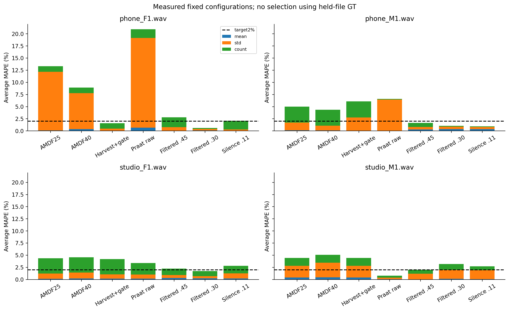
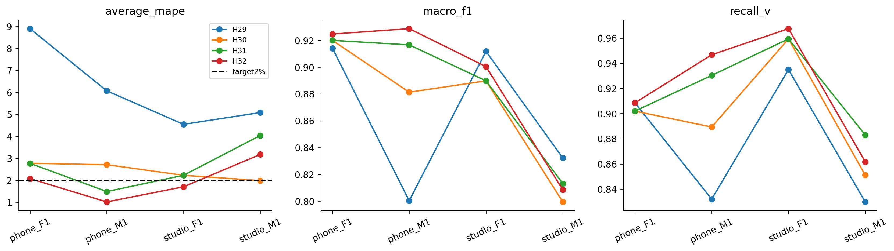

# Đọc notebook reference pipelines

Mở [REFERENCE_PIPELINES_LOCAL.ipynb](REFERENCE_PIPELINES_LOCAL.ipynb) để xem bảng, mã tính từ WAV và hai figures. Notebook này bổ sung AMDF_LOCAL_TRAIN.ipynb và AMDF_TARGET_2PCT.ipynb, không sửa notebook gốc.

## Những gì thực sự đã chạy

Năm code cells được thực thi nguyên source bằng Python/display adapter, không phải Jupyter kernel. Dùng môi trường local `../.venv-bt2-world/Scripts/python.exe`, PyWORLD0.3.5 và native Praat7.0.02. Tính lại60 dòng cấu hình cố định và16 dòng nested, khớp các bảng đã lưu với tolerance1e-8. Verifier tự tính mean/std/count/MAPE và V/UV/SIL từ contour, kiểm LAB/WAV/hash/binary/fit pools/lựa chọn outer và PNG/SVG. Receipt: [results/reference_notebook_verification.json](results/reference_notebook_verification.json).

Lệnh chạy từ repository:

```powershell
& '..\.venv-bt2-world\Scripts\python.exe' research_workbench_2026_10_07\execute_reference_notebook.py
& '..\.venv-bt2-world\Scripts\python.exe' research_workbench_2026_10_07\verify_reference_notebook.py
```

Không chạy lại family experiment hoặc chọn lại threshold trong notebook. Nó dùng các lựa chọn đã đăng ký, tính lại prediction từ WAV và so kết quả. Người dùng có thể mở bằng Jupyter với interpreter tương ứng; bản kiểm chứng hiện tại chưa phải lần chạy kernel Jupyter.

## Cách hiểu các bảng

Fixed LOFO là một cấu hình giữ cố định khi chấm từng file; cổng AMDF fit bằng ba file còn lại. Praat không học tham số từ nhãn trong inference. Nested là quy trình chọn cấu hình bằng inner folds của ba file, rồi chấm outer file. Không ghép best cấu hình của từng file bằng GT của chính file ấy.

Average MAPE là trung bình ba lỗi phần trăm mean/std/count. Std dùng ddof=0; count là số F0 hữu hạn. Figure đóng góp chia mỗi lỗi cho3, nên tổng thanh bằng Average MAPE. F1 và recall chỉ chấm V/UV; SIL false voiced báo riêng. Cải thiện mean bốn file không thay yêu cầu từng file≤2%.

| Quy trình | Nested mean (%) | File tệ nhất (%) | Mỗi file≤2% |
|---|---:|---:|---|
| H29 Harvest+cổng chọn nested | 6.149822 | 8.899895 | Chưa |
| H30 Praat raw/filtered chọn nested | 2.422852 | 2.769856 | Chưa |
| H31 voicing threshold chọn nested | 2.630492 | 4.038845 | Chưa |
| H32 silence threshold chọn nested | 1.992154 | 3.175722 | Chưa |

Các dòng là quy trình với registry/control khác nhau, không phải cùng một cấu hình hoặc mức cải thiện đơn điệu. H30 qua gates tương đối với AMDF; H31/H32 không qua gates của vòng riêng. Không tự promote hoặc đổi frozen_config.

## Hai loại chuẩn cần phân biệt

| File | F0num chuẩn file | Tâm khung nhãn V trên canonical25/10 |
|---|---:|---:|
| phone_F1 | 148 | 153 |
| phone_M1 | 232 | 244 |
| studio_F1 | 127 | 123 |
| studio_M1 | 82 | 94 |

Nhãn đoạn V chưa cung cấp cao độ từng khung. F0num chuẩn còn phụ thuộc cách tạo chuẩn/lưới ban đầu chưa được tái dựng đầy đủ. Vì vậy V recall cao không bảo đảm count MAPE bằng0, và count trùng chuẩn chưa chứng minh V/UV hoặc cao độ đúng. Không sửa GT, thêm khung, cắt count hoặc ép phân phối để đạt mục tiêu. Chỉ bốn file đã nghiên cứu nhiều lần; các kết quả nested vẫn exploratory.





## Kiến thức paper đã áp dụng

Nguồn và mức đọc ở [PAPER_KNOWLEDGE_WITHOUT_PDF.md](PAPER_KNOWLEDGE_WITHOUT_PDF.md). Harvest từ abstract ISCA và source tác giả; Praat từ manual HTML và native implementation. Chúng là các nguồn khác nhau, không coi đọc code/manual là đọc toàn bộ paper. Không extract PDF, không nhập số benchmark paper vào bảng BT2.

Jev prospective review trước H32 bị validation error, không có phán xét và không retry. Mọi phép tính trong notebook/verifier do code thực hiện. pYIN được đo riêng ở H33 sau khi notebook này đã chạy; kết quả và failures xem [H33_REPORT.md](H33_REPORT.md) và [H33_ERROR_ANALYSIS.md](H33_ERROR_ANALYSIS.md). Notebook này chưa chứa H33. SWIPE/REAPER vẫn chưa đo.
