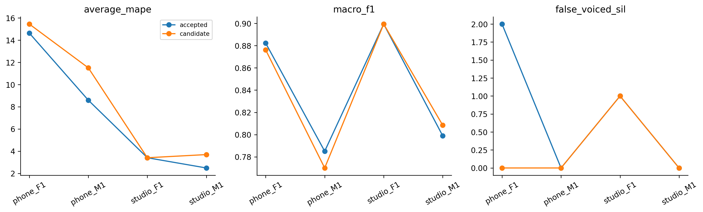
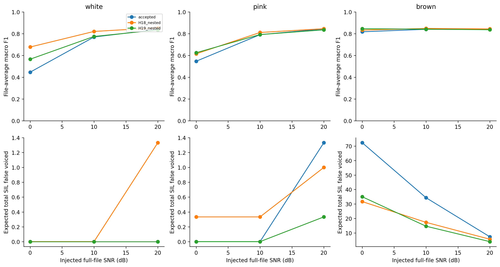
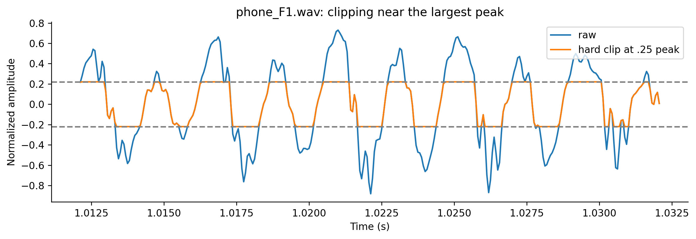
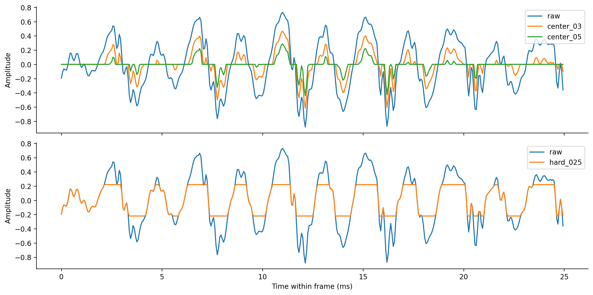

# Kết quả thử nghiệm ngày 07/10: bộ lọc, tuning, F/M và clipping

Đã hoàn thành hai vòng tuning và một vòng stress trên bốn file train local. Các ứng viên giảm lỗi ở một số điều kiện nhiễu, nhưng chưa đạt toàn bộ tiêu chí thay baseline trên dữ liệu sạch. Giữ frozen accepted ACF, giữ notebook gốc và tất cả kết quả không đạt.

Phiên này chạy 81 cấu hình H18; 243 cấu hình logistic + một fallback ACF ở H19; 120 trường hợp stress, mỗi trường hợp ba model, ở H20. Có 12 cặp figures PNG/SVG kèm CSV, generator/hash và captions, cùng một ảnh xác nhận phản hồi Gemini. Không dùng test, Google Drive hoặc deep learning.

## 1. Phân biệt các bước trong pipeline

F0 là tần số cơ bản, đo bằng Hz. ACF là hàm tự tương quan, tìm độ trễ lặp lại của tín hiệu để suy ra chu kỳ. V/UV/SIL là hữu thanh/vô thanh/khoảng lặng theo nhãn đoạn.

| Thành phần | Vai trò trong thí nghiệm |
|---|---|
| High-pass / low-pass / band-pass | Giảm thành phần phổ trước khi tính ACF; không tự trả F0 |
| Frame / hop | Độ dài cửa sổ và bước nhảy giữa hai lần tìm F0 |
| Logistic regression | Học cách kết hợp ACF score và năng lượng RMS để quyết định voiced |
| C của logistic | Điều chỉnh mức phạt hệ số; C nhỏ tăng regularization |
| Path và median | Chọn chuỗi ứng viên F0, làm mượt trong voiced run |
| Hard clipping | Cắt đỉnh vượt giới hạn biên độ; được tạo để stress |
| Center clipping | Loại phần biên độ nhỏ quanh zero trước ACF; chưa thử ở lượt này |

Đọc [giải thích bộ lọc/frame](FILTER_AND_FRAME_EXPLANATION.md) và [registry trước đo](REGISTRATION.md). C là inverse regularization strength theo [tài liệu scikit-learn](https://scikit-learn.org/stable/modules/generated/sklearn.linear_model.LogisticRegression.html); phiên bản runtime thực là1.8.0, không suy phiên bản cài từ trang stable.

## 2. Cách chấm và chọn tham số

AvgMAPE ở đây là trung bình lỗi phần trăm của F0mean/F0std/F0num từng file rồi bình quân bốn file. Nó không phải sai số F0 từng khung. LAB đang dùng cung cấp nhãn đoạn và thống kê file, chưa có contour F0 reference từng timestamp.

LOFO giữ một file để chấm và fit trên ba file khác. Trong nested LOFO, file ngoài còn được giữ khỏi bước chọn cấu hình: inner LOFO chỉ dùng ba file còn lại, mỗi lần fit hai/chấm một; chọn cấu hình, refit ba file và chấm file ngoài.

Selected LOFO là điểm của cấu hình đã được chọn bằng chính vòng LOFO đó, nên chịu ảnh hưởng lựa chọn. Nested đánh giá quy trình chọn. Nó vẫn không xóa lịch sử đã xem bốn file để đề xuất registry; chỉ bốn file, chưa đủ metadata để coi chúng là bốn người nói độc lập.

Frame thực đã chạy20/25/40ms, hop5/10/20ms. Để count không tăng/giảm cơ học theo hop, output được ghép lên cùng timestamp grid của baseline25/10. Nearest center trong half-hop, ngoài support thì abstain; không nội suy F0 xuyên UV. Native count và projection coverage được lưu riêng. Đây là adapter chấm, không tạo GT mới hoặc ép thuật toán dùng25/10.

## 3. Kết quả dữ liệu sạch

| Quy trình | Train AvgMAPE (%) | Selected LOFO (%) | Nested (%) | Kết luận |
|---|---:|---:|---:|---|
| Accepted ACF | 6,177968 | 7,279236 | 7,279236 | Giữ baseline |
| H18: chọn filter/frame/hop | 5,282995 | 3,409875 | 8,295856 | Không đạt |
| H19: cùng grid + logistic/C | 3,822016 | 3,815757 | 8,513215 | Không đạt |

H18 chọn final band-pass30–800Hz/frame25/hop20. H19 chọn final low-pass800Hz/frame25/hop20/C=.1. Đây là lựa chọn từ train, chưa được đưa vào notebook champion.

H18 vi phạm nestedMAPE, phone_F1std và mức tăng MAPE từng file. H19 giảm SIL false voiced từ3 xuống1 trên tổng bốn outer files nhưng recallV giảm0,865862→0,854401, quá mức giảm0,01 được đăng ký; nestedMAPE và mức tăng từng file cũng không đạt.

Các lựa chọn ngoài H19 cho thấy frame/hop đã được mở thực sự:

| File ngoài | Cấu hình chọn chỉ từ ba file khác |
|---|---|
| phone_F1 | LP1500Hz, frame20ms, hop5ms, C=.1 |
| phone_M1 | HP60Hz, frame40ms, hop10ms, C=10 |
| studio_F1 | Accepted raw25/10 fallback |
| studio_M1 | HP60Hz, frame25ms, hop20ms, C=.1 |

Đọc [H18](H18_REPORT.md), [H19](H19_REPORT.md). Receipts kiểm tra [H18](results/H18_verification.json), [H19](results/H19_verification.json) tái tính nested statistics/counts từ contour, dựng nhãn lại từ LAB, kiểm tra inner fit/selection exclusions, code/data hashes và nguồn figures.

## 4. Đọc riêng từng bộ lọc

Giữ slice25/10 để đối chiếu một biến không có nghĩa khóa toàn bộ tuning ở25/10. H18 slice cho LOFO: raw7,279236%, HP30Hz9,166367%, HP60Hz7,372173%, LP1500Hz7,715614%, LP800Hz4,046405%, BP30–800Hz4,587153%.

Một số filter có điểm đáng nghiên cứu tiếp, nhưng không lấy điểm đẹp nhất sau khi xem bảng làm đánh giá độc lập. Chọn đúng cấu hình tốt trên một subset nhỏ là vấn đề khác với việc cấu hình đó đạt điểm thấp khi đã đo đủ bốn file.

Slice raw25/10/C1 trong H19 tái hiện H16 LOFO5,470735%. H19 thất bại của quy trình chọn rộng không chứng minh logistic cố định vô dụng.

Đọc [grid H18](H18_GRID_EXPLANATION.md), [grid H19](H19_GRID_EXPLANATION.md). Full grid summaries/guards và heatmaps lưu cả cấu hình tốt/xấu. Tất cả inner rows ở hai vòng có statistics hữu hạn.

## 5. F/M và phone/studio

Theo file-stat GT, hai file M có mean116,9/123,7Hz; hai file F có mean215,6/229,6Hz. Khung20ms ở70Hz chỉ chứa1,4chu kỳ; khung40ms chứa2,8chu kỳ. Số chu kỳ minh họa giúp giải thích support, không phải phép xác minh pitch từng khung.

| Nhóm theo tên | Baseline nested AvgMAPE (%) | H18 (%) | H19 (%) |
|---|---:|---:|---:|
| F: 2 file | 9,021153 | 11,144184 | 9,428156 |
| M: 2 file | 5,537319 | 5,447528 | 7,598274 |
| Phone: 2 file | 11,613204 | 13,904534 | 13,477913 |
| Studio: 2 file | 2,945269 | 2,687178 | 3,548518 |

Đây là mô tả bốn file theo tên. Mỗi ô F/M×thiết bị chỉ có một file; chưa thể tách ảnh hưởng giới, người nói, utterance, thiết bị và sample rate. Không kết luận thuật toán tốt cho mọi giọng nam/nữ. Boundary trong CSV H20 dùng cửa sổ25ms chấm chung; không phải toàn bộ vùng boundary của mọi native frame40ms.

## 6. Nhiễu: có cải tiến cụ thể, chưa robust toàn diện

H20 dùng fixed clean-trained outer choices, không chọn lại cấu hình theo noise. White/pink/brown: SNR20/10/0dB ×3seed ×4file=108cases; clipping12cases; tổng120case/360modelrows. Accepted của cả120case khớp H15 cũ trong tolerance1e-8.

Brown noise0dB, tổng SIL false voiced trên bốn file lấy trung bình ba seed:

| Model | SIL false voiced trung bình tổng4file | AvgMAPE (%) | MacroF1 bình quân file |
|---|---:|---:|---:|
| Accepted | 72,333333 | 74,732928 | 0,817894 |
| H18 outer choices | 31,666667 | 23,318416 | 0,833537 |
| H19 outer choices | 35,000000 | 22,480940 | 0,845632 |

Đây là lợi ích đã đo trên noise mô phỏng. Ba seed không tạo thêm người nói; không so trực tiếp số72,33 của3seed với số66,55 của20seed ở báo cáo H15 như thể cùng tập realization. Các model không tốt hơn ở mọi noise/SNR; ví dụ white20dB có MAPE baseline thấp hơn hai ứng viên.

## 7. Clipping: tỷ lệ peak chưa nói đủ mức hỏng

Hard clipping ở±.25peak cắt9,38% samples của phone_F1 nhưng0,94% samples của studio_M1. Cùng ratio có mức tác động khác nhau; CSV báo sample fraction và fraction cửa sổ có clipping.

Ở ratio.25, AvgMAPE bình quân: baseline8,018837%, H18 9,366997%, H19 10,128628%. Vì vậy lợi ích brown noise chưa chuyển thành cải thiện thống kê dưới hard clipping. MacroF1 có thể tăng trong khi MAPE tăng, nên phải đọc cả phân loại lẫn file-stat.

Audit không thấy sample chạm nativeint16rails trong bốn file; điều đó chưa loại trừ analog clipping hoặc compression trước ghi. Không suy phone đã bị nén chỉ từ tên thiết bị.

Đọc [H20: nhóm, noise và clipping](H20_REPORT.md), [rawcases](results/H20_stress_cases.csv), [clipfraction](results/H20_clipping_fraction.csv), [boundary](results/H20_boundary_metrics.csv). Coverage tính statistics của120cases là100%; không tính undefined nhưerror0.

## 8. Gemini và Jev

Gemini đã được hỏi theo yêu cầu và trả lời đầy đủ phần ý tưởng. Đề xuất zero-phase filtering, center clipping, thêm zero-crossing rate vào logistic và micro-tuningC. Ở đợt H18–H20, các ý tưởng này được giữ như giả thuyết; lượt nối tiếp đã thử riêng center clipping (H21) và thêm ZCR (H22), xem mục10.

Các lỗi đã ghi: khuyên so nativecount trực tiếp dù hop thay đổi; nói logistic gục dưới brown noise khi H15 không có logistic; khẳng định center clipping sẽ triệt false voiced chưa đo; suy phone bị nén. Zero-phase không bảo toàn mọi waveform và có magnitude khác causal. Đọc [log/đối chiếu](AI_REVIEW.md), [prompt thực gửi](GEMINI_SENT_PROMPT.txt), [AX phản hồi](GEMINI_RESPONSE_AX.txt). Raw AX được bỏ trailing whitespace để kiểm tra Git, giữ nguyên nội dung quan sát.

Jev có một call chọn hướng tiếp dựa trên bằng chứng H18, trước khi H19/H20 hoàn tất. Nó chọn explicitoptionnone, tức ưu tiên xem các vòng đang chạy trước; không phải công cụ ra lệnh dừng nghiên cứu. Request72fbafc5-e38e-4fdf-abc0-a2ff4294c033,1939input/130outputtokens,latency375ms; ID hợp lệ. Choice.59 và independent fitnone.81 không calibrated. [Raw input/output và diễn giải](JEV_NEXT_HYPOTHESIS.json).

Tool-level none.02 là abstention khỏi shortlist, khác option có IDnone đang được chọn. Không coi các số này là xác suất thuật toán sẽ thành công, độ chính xác hoặc bảo đảm. Jev không tính MAPE/count, không nghe WAV, không chạy notebook và không cấp quyền.

## 9. Kiểm tra, Git và hướng tiếp

Raw25/10 features và metrics tái lập baseline; filter linearity/chunk continuity được kiểm tra. H18/H19:1296/3904innertraces, nested contour statistics và nhãn được đối chiếu; WAV/LAB/statshashes giữ nguyên từ provenance đã lưu. H20:360rows/120unique cases, achievedSNR đúng, control khớpH15, figures/source/generatorhashes và PNG/SVG đọc được. Notebook/test không rerun trong lượt này.

Các kết quả được commit/push riêng trên codex/train-mape-investigation, không merge main: H18 1ccb47c, H19 6b8ba23, gridH19 6b90124, H20 a6514b9. Tổng hợp này cùng STATE sẽ được commit riêng sau kiểm tra liên kết.

Vòng đăng ký hiện tại đã hoàn thành, gồm H21/H22 nối tiếp ở mục10. Queue tiếp có thể đối chiếu causal/zero-phase cùng magnitude controls hoặc chuẩn hóa ACF khác; đăng ký gate và grid trước đo. Cần kiểm tra cơ chế gây lỗi theofile trước mở thêm nhiều chiều hyperparameter. Không mở test để quyết định grid mới.

Sources về API/cơ chế: [SciPy butter](https://docs.scipy.org/doc/scipy/reference/generated/scipy.signal.butter.html), [SciPy filtfilt](https://docs.scipy.org/doc/scipy/reference/generated/scipy.signal.filtfilt.html). Figures/Git/code là nguồn số đo, phản hồi AI là nguồn ý tưởng cần kiểm chứng.

## 10. Nối tiếp: hai ý tưởng Gemini đã được đo riêng

H21 thử center clipping: đặt mẫu có biên độ nhỏ về0, trừ mức clipping khỏi phần còn lại trước tính ACF. Khác hard clipping H20 là cắt các đỉnh lớn. Mức0/.3/.5 được đăng ký trướcđo; không ghép đổi filter, geometry hoặc classifier. Giữ25/10 ở hai vòng này nhằm cô lập cơ chế, không phải bỏ việc thay frame/hop đã thực hiện H18/H19.

| Cấu hình cố định, LOFO4file | AvgMAPE file-stat (%) | MacroF1 | RecallV | SIL false voiced |
|---|---:|---:|---:|---:|
| Accepted ACF raw | 7.279236 | 0.841398 | 0.865862 | 3 |
| Center clipping30% | 8.534217 | 0.825778 | 0.856473 | 2 |
| Center clipping50% | 11.540008 | 0.795568 | 0.809880 | 1 |
| Logistic2D C1 | 5.470735 | 0.863433 | 0.884072 | 1 |
| Logistic3D C1 thêmZCR | 5.757400 | 0.864048 | 0.887902 | 1 |

H21 chọn raw ởfinal vàmọiouterfold; nested7.279236%, không cải thiện. Bớt khung SIL sai ở mức clipping lớn không đủ bù lỗi thống kê F0 và bỏ sót V. Đọc [H21 report](H21_REPORT.md), [đăngký](H21_REGISTRATION.md), [toàngrid kể cả mức khôngđược chọn](results/H21_grid_summary.csv).

H22 chỉ thêm ZCR vào logisticC1. ZCR là tần suất tín hiệu đổi dấu sau trừ mean khung, đơn vị crossings/s; không là F0. Scaler và coefficients fit đúngtrainfold. Fixed3D tăng nhẹ F1/recall bình quân so2D nhưng AvgMAPE tăng, file phone_M1recallV giảm0.827869→0.790984.

Quy trình chọn3options H22: final chọn2D; mỗiouter chọn trênother3, chỉ outerphone_M1 chọn3D, baouterkhác chọnraw. NestedAvgMAPE **7.732759%** so accepted **7.279236%**, gateFAIL. Không dùng điểm fixed/selected5.47% thay cho kết quả7.73% của quy trình chọn. Đọc [H22 report](H22_REPORT.md), [đăngký](H22_REGISTRATION.md).

Phân tích fixed2D→fixed3D ởphone_M1:12khung V trước nhận đúng chuyển thành bỏ sót,3khung V trước bỏ sót được nhận, rònggiảm9. Các12khung mất có ZCR bình quân3161.24crossings/s, các232khung V còn lại1575.49. Đây là tương quan với thay đổi quyết định; thêmZCR cũng refit hệ sốACF/RMS/intercept nên không coi một ZCR term là tác động nhân quả tách riêng. Không suy thành “ZCR hại giọng nam”. [Bảng khung/hệ số và giải thích](H22_ERROR_ANALYSIS.md).

Cả hai registry/runner được kiểm tra vàpush trướcđo. Mỗi vòng48innertraces/24metricrows; counts/mean/std/MAPE/classification trên nested contours được tính lại, LAB/WAV/sourcehash giữ nguyên. verify_selection.py phát lại lựa chọn từtoàntraces vàtính lại tấtcảgates; diagnostics1291frame rows đối chiếu fixedcounts/transitions. Thêm6cặpPNG/SVG, tổng18cặp khoa học. Không có thí nghiệmnoise mới hoặc test rerun trong lượt này; không thaychampion.

Các commit đãpush riêng vàverifyremote: đăngkýH21 `45f405b`, kết quảH21 `dc87b79`, đăngkýH22 `ad11efe`, kết quảH22 `0e20eb9`, kiểm trađộclập `fbded31`, phân tíchkhung `4cf4653`. Tổnghợp/STATE đượccommit riêng khihoàn tất. Không merge main, không tạo schedule.

Hai ý tưởng lấy từ phảnbiệnGemini đã lưu; lượt nối tiếp không gửi thêmGemini hoặc gọiJev mới, vì các sốđếm/gate/tính toán cần code chứkhông cầnphánđoánngữnghĩa. Không discovery hoặc retry SystemOne. Nguồn cơ chếcenterclipping: [Columbia autocorrelation demonstration](https://www.ee.columbia.edu/~dpwe/classes/e6820-2001-01/matlab/MAD/auto/auto.htm); API [LogisticRegression](https://scikit-learn.org/stable/modules/generated/sklearn.linear_model.LogisticRegression.html). Không dùng nguồnweb hoặc phảnhồiAI như sốđo thực nghiệm.
